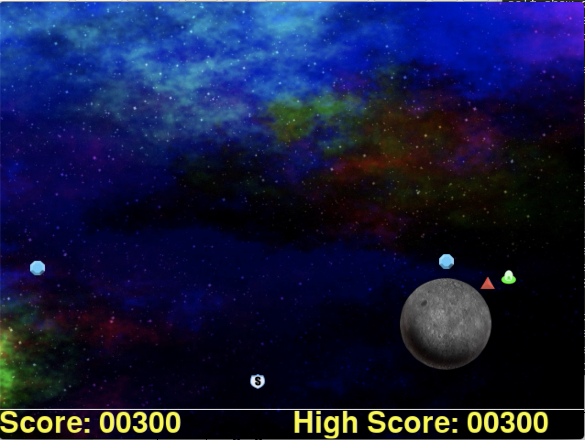
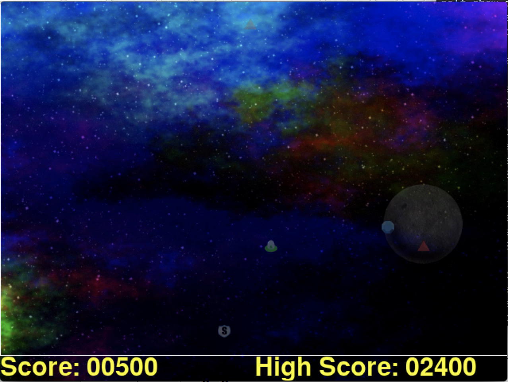
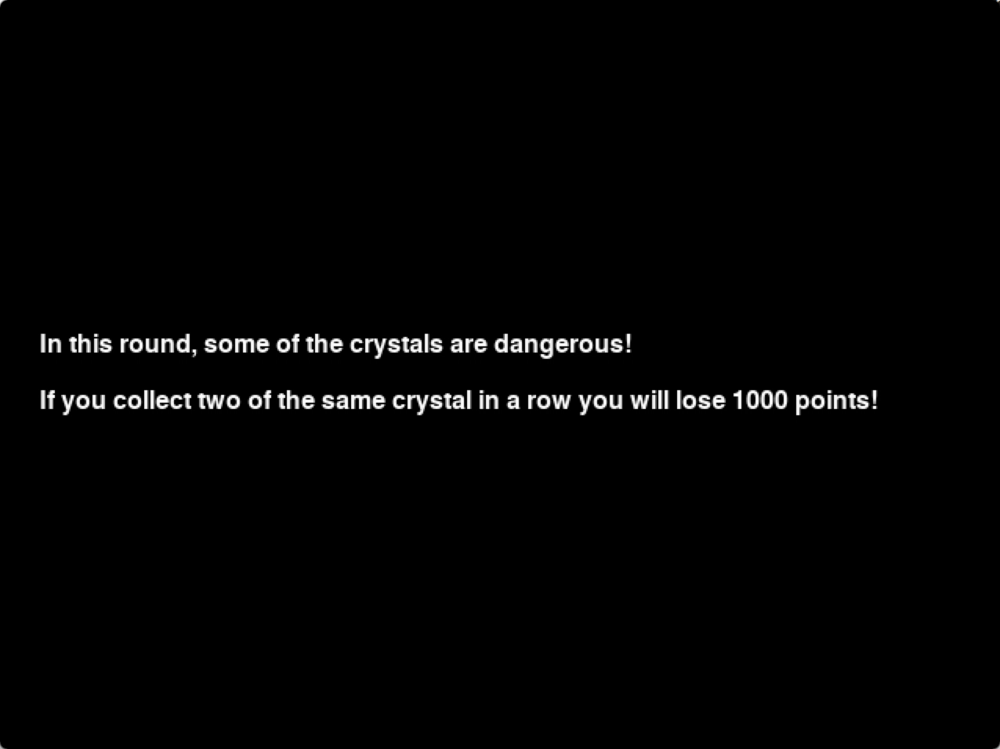

Stimulus
========

Asteroid Impact is a point-and-click style video game where subjects use a cursor to collect crystal-shaped targets that are displayed at different locations while avoiding asteroids that bounce around the screen. Game difficulty is manipulated by altering the number of targets a subject needs to collect, the number of objects to be avoided, and the rate at which these objects move. The stimulus provides tremendous experimental control in that all random aspects of the game are removed; any differences in game experience are the result of player intervention. To help resolve this potential confound, the stimulus provides a high resolution content analysis of all events in the game (e.g., when a crystal is collected, x/y position of the player's cursor, time when player dies) with a 16ms temporal resolution. This content analysis is exported to a .csv file that allows for subsequent computation using a wide variety of analysis packages.

In terms of experimental manipulation, researchers can specify different levels of difficulty a priori as well as a time duration for how long a given level will last. Asteroid Impact also features an adaptive mode where the game automatically increases or decreases in difficulty depending on player performance. Each of these game states can be separated by a black screen or set of instructions. These different game states can be scripted together in any sequence the researcher may choose, thereby allowing the development of sophisticated experimental paradigms. The game's artwork can easily be manipulated and the game scales to fit in both full-screen and windowed modes across a variety of screen resolutions. The game is also designed to interface with TTL triggers, a feature which allows for synchronizing game states with psychophysiological and neurophysiological measurement equipment.

Asteroid Impact is written in Python and carries a fully open source license (CC BY-SA 4.0). This means that the game can be modified to suit the needs of any given research lab. Moreover, the game is platform agnostic and can be used on Windows, OS X, or Linux (see known bugs below). The game requires minimal computational power and can run on low-cost computer systems. Taken together, these features provide the research community with a highly flexible tool that overcomes the issues discussed earlier. Moreover, the game conforms to the latest trends in open-science by providing a free tool that allows for replication.

Conditions
----------

Control Condition
^^^^^^^^^^^^^^^^^

In the control condition, participants will play Asteroid Impact without any modulations to cognitive or perceptual load. 

    Main gameplay for Asteroid Impact

High Perceptual Load Condition
^^^^^^^^^^^^^^^^^^^^^^^^^^^^^^

In the high perceptual load condition, the opacity of the foreground elements is reduced by 75%, increasing the effort required to identify stimuli and removing the ability to attend to motion in the periphery. 

.. figure:: images/perc_inst.png
    :width: 100%
    :align: center
    :alt: alternate text
    :figclass: align-center

    Instruction screen preceding the high perceptual load condition

    High perceptual load condition

High Cognitive Load Condition
^^^^^^^^^^^^^^^^^^^^^^^^^^^^^

In the high cogntive load condition, participants are required to maintain the last crystal they collected in working memory. Collecting two of the same color crystal in a row results in a loss of 1000 points. 

    Instruction screen preceding the high cognitive load condition

.. figure:: images/cogload.png
    :width: 100%
    :align: center
    :alt: alternate text
    :figclass: align-center

    High cognitive load condition

Secondary Task
^^^^^^^^^^^^^^
During gameplay, participants also responded to a secondary task, in which they were asked to press the spacebar whenever they saw an image of a white star appear on the screen. The white star was presented at a random location on the screen and at a random time point within each 6-second block of game play. Probes remained on screen for 6 seconds before disappearing. The onset of the probe was accompanied by a 440Hz auditory tone.  